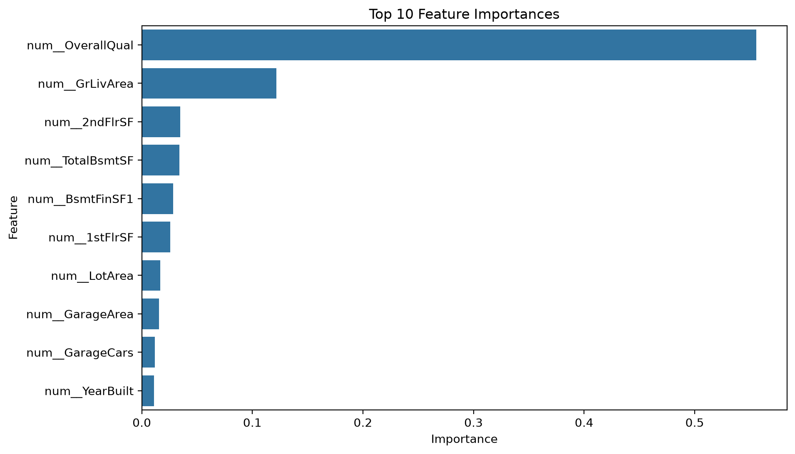

# House Price Prediction (Regression)

## Project Overview

This project predicts house sale prices using machine learning regression models.

The project includes:

- Exploratory Data Analysis (EDA)
- Data preprocessing
- Feature engineering
- Model training
- Model evaluation
- Feature importance visualization

---

## Dataset

House Prices – Advanced Regression Techniques

Target Variable:

- SalePrice

---

## Models

- Linear Regression
- Random Forest Regressor

Random Forest achieved the best performance.

---

## Model Performance

| Metric | Score |
|---------|-------|
| MAE | 17,546.71 |
| RMSE | 28,527.52 |
| R² | 0.8939 |

---

## Visualizations

### Feature Importance



---

## How to Run

Train model

```bash
python src/train.py
```

Evaluate model

```bash
python src/evaluate.py
```

---

## Business Interpretation

The Random Forest model predicts house prices with an average error of approximately **$17,547**.

This means that for a typical house, the predicted selling price is usually within about **$17.5k** of the actual sale price.

---

## Technologies Used

- Python
- Pandas
- NumPy
- Matplotlib
- Seaborn
- Scikit-Learn
- Joblib

---

## Author

**Inshrah Mumtaz**